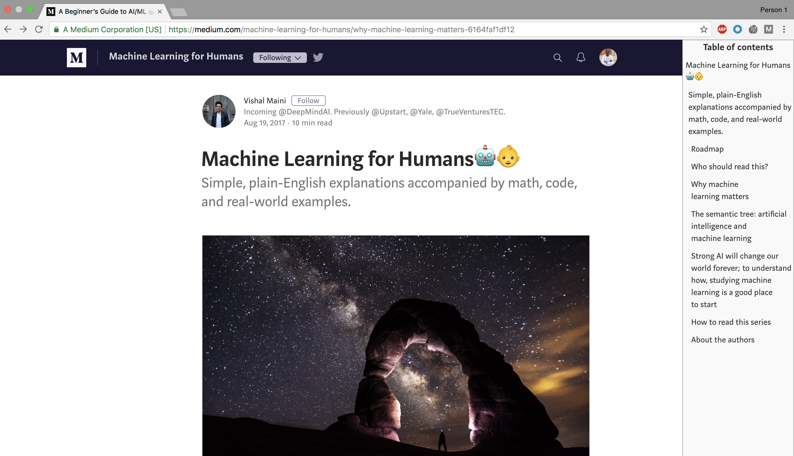

# Medium Toc
Display table of contents on [Medium](https://medium.com) articles

So, this is the code for a tiny chrome extension that gives you the missing table of contents on medium articles.
I created this because, it's been a pain to scroll up and down while reading articles on Medium.

## How to use it
1. [Download](https://github.com/ousmanedev/medium_toc/archive/master.zip) the code and unzip it
2. Then, load it into chrome. See how to do that [here](https://developer.chrome.com/extensions/getstarted#unpacked)
3. Now, visit an article on medium, and enjoy your Toc

## Why is it not on chrome store ?
- Not necessary
- I have no time to design icons...
- I don't want to pay the 5 USD developer fee

## Contributions
Please, feel free to make it better !
